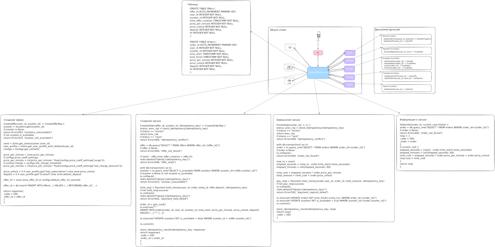

# ADR: scooter-rental-service

## 1. Scope / Title

### Title

Название: **Scooter Rental Service**

### Scope

Данный ADR описывает архитектурное решение для сервиса краткосрочной аренды электрических самокатов — **scooter-rental-service**.  
Документ охватывает проектирование и реализацию логики работы с офферами и заказами, включая аренду, тарификацию, кэширование и взаимодействие с микросервисами системы.

В область ADR входят:

- Создание и завершение заказов аренды;
- Формирование и валидация офферов;
- Расчёт стоимости поездки;
- Интеграция с микросервисами: `scooters`, `payments`, `users`, `zone`, `config`;
- Хранение и периодическая очистка заказов.

Из области ADR **исключаются**:

- Клиентские приложения (мобильное и веб);
- Системы аналитики и отчётности;
- Управление пользователями и платежами за пределами аренды.

### Постановка задачи

Задача — разработать backend-сервис **аренды электросамокатов**, обеспечивающий пользователям возможность:

- получать оффер (предложение) для начала аренды самоката,  
- создавать заказ (начинать аренду),  
- завершать заказ (окончание аренды с фиксацией стоимости),  
- просматривать текущий статус и стоимость активной поездки.  

Основная логика взаимодействия с пользователем реализуется внутри **единого микросервиса `scooter-rental-service`**.  
Он обращается к другим микросервисам системы для получения необходимой информации:  

- `scooters` — данные о доступных самокатах и их состоянии,  
- `payments` — проведение и проверка платежей,  
- `users` — информация о клиентах и их тарифах,  
- `zone` — зоны и правила тарификации,  
- `config` — конфигурационные параметры и системные настройки.  

Взаимодействие между сервисами осуществляется через API.  
Для каждого микросервиса предусмотрен собственный уровень надежности и кэширования.  
Критичные микросервисы (`scooters`, `payments`) должны обеспечивать высокую доступность.

## 2. Business Requirements

1. **Обеспечить надёжный и удобный процесс аренды самокатов.**  
   Пользователь должен иметь возможность бронировать, начинать и завершать поездку.

2. **Поддерживать прозрачное ценообразование.**  
   Пользователь должен видеть актуальную стоимость поездки.

3. **Обеспечить устойчивую работу при сбоях микросервисов.**  
   Критичные сервисы (`scooters`, `payments`) должны обрабатываться с retry и идемпотентностью.  
   Некритичные сервисы (`config`, `zone`, `users`) должны использовать кэш или fallback-механику.

4. **Хранить и управлять данными о заказах.**  
   Должна быть возможность настройки периода хранения данных по зонам.

## 3. Functional Requirements

1. Сервис должен предоставлять API для:
   - создания оффера;
   - создания заказа (начала аренды);
   - завершения заказа;
   - получения информации о заказе и текущей стоимости поездки.

2. Система должна контролировать **свежесть оффера**: устаревшие предложения недействительны.

3. Система должна обеспечивать **идемпотентность** всех операций, изменяющих состояние заказов и офферов.

4. Система должна автоматически **удалять заказы старше 1 года**, при этом период хранения настраивается по зонам.

5. Взаимодействие с микросервисами:
   - `users` — при сбое использовать fallback с “жадным прайсингом”;
   - `config` — кэш обновляется каждую минуту;
   - `zone` — использовать LRU-кэш, данные старше 10 минут считать невалидными (настройка конфигом);
   - `scooters`, `payments` — критичные источники, требующие retry.

6. Сервис должен предоставлять ручку с информацией о заказе и текущей стоимости поездки, доступную для клиента.

7. Все изменения данных должны быть логируемыми.

8. **Нагрузочные параметры:**
   - **X = 100 RPS** — число одновременно создаваемых заказов (внешняя нагрузка);
   - **Y = 50** — количество просмотров информации о заказе на один заказ;
   - **Z = 1 КБ** — средний размер записи о заказе в базе данных.

## 4. Non-Functional Requirements

### Reliability

- Критичные микросервисы (`scooters`, `payments`) должны обрабатываться с retry и гарантией идемпотентности.  
- Данные хранятся в БД.

### Scalability

- Архитектура должна поддерживать горизонтальное масштабирование.
- Изменение параметров логики работы через конфиги.

### Maintainability

- Кодовая база должна быть разделена по доменам (офферы, заказы, зоны и т.д.).
- Архитектура должна соответствовать принципам **SOLID** и допускать добавление новых фич без изменения существующей логики.

### Performance

- Система должна выдерживать нагрузку в соответствии с параметрами X,Y,Z.  
- Кэширование используется для снижения обращений к другим микросервисам.

### Storage

- Все данные заказов хранятся максимум 12 месяцев.  
- Очистка выполняется периодически через фоновый процесс, период зависит от зоны.  
- Размер записи о заказе (Z) ≈ 1 КБ.

## 5. Scheme

### Общая схема сервиса

Сервисы `Zones`, `Payments`, `Scooters`, `Configs`, `Users` будут запускаться отдельно от основного сервиса и использовать собственные базы данных или внешние системы для хранения информации (архитектура этих сервисов не рассматривается в ADR).

### Взаимодействие с S3

Сохранение заказов в S3 после завершения позволит значительно снизить объём базы дынных с таблицей `orders` и удешевить её. Также добавление S3 решает проблему шардирования таблицы `orders` на несколько хостов (так как с учётов времени хранения заказа в 1 год нужно сохранить около 3 TB данных).

Процесс сохранения заказов в S3:

- Заказы будут перемещаться в S3 в момент завершения заказа, после успешного сохранения в S3 заказ считается завершённым и удаляется из таблицы `orders`.
- Каждый заказ будет сохраняться в отдельный файл по пути `/orders/zone={zone-id}/year={year}/month={month}/day={day}/{order_id}.json`
  - Таким образом в S3 будет создаваться 100 файлов в секунду.
  - Всего в подпапке одного дня будет 8.64 миллиона файлов с суммарным размером около 8.3 GB.
- На стороне S3 для каждой зоны будет включён свой TTL для файлов с заказами

## 6. Alternatives

### Два сервиса для `offers` и `orders`

Есть два альтернативных варианта для реализации логики `offers` и `orders`:

1. Использование одного микросервиса и одной БД для ручек `/offers/...` и `/orders/...`
2. Использование двух разных микросервисов и БД для ручек `/offers/...` и `/orders/...`

Плюсы и минусы первого подхода относительно второго:

- `+` Упрощается процесс деплоя и контроля совместимости для сервиса
- `+` Есть возможность делать транзакционные изменения одновременно с таблицами `offers` и `orders`
- `-` Нету возможности обновить отдельно только код для сервиса `offers` или `orders`
- `-` Есть вероятность, что сервисы `offers` и `orders` будут создавать разные профили нагрузки на базу данных, что может привести к её дестабилизации

Был выбран **первый подход, с одним сервисом**, так как по рассчётам нагрузки было принято решение, что нагрузка на базу будет не слишком различаться между `offers` и `orders`, а также использование одного сервиса значительно упростит процесс деплоя сервиса.

### Хранение всех заказов в таблице `orders` без S3

Рассматривалось два альтернативных варианта для выполнения функционального требования по хранения информации о заказах (в среднем 1 KB) в течение года, в зависимости от зоны:

1. После завершения переносить заказы из таблицы `orders` в S3, в папку с соответствующим TTL
2. Хранить все заказы в таблице `orders` без S3 и настраивать TTL для каждой строки в отдельной колонке

Плюсы и минусы первого подхода относительно второго:

- `+` Хранение большого объёма данных в S3 (около 3 TB) значительно дешевле, чем в базе данных
- `+` Нету необходимости шардировать таблицу `orders`, так как её активный размер будет не слишком большим
- `-` Требуется ручная или автоматическая настройка TTL для зон внутри S3
- `-` Нету возможности делать индексы по заказам в S3, что может сказаться на времени поиска исторического заказа

Был **выбран второй подход, с хранением в S3**, так как в случае нехватки каких-либо индексов в S3, можно изменить формат хранения данных, чтобы файловая структура давала достаточную эффективность для бизнес задачи. Так же было решено, что проблема с шардированием таблицы `orders` более значимая, чем настройка TTL для файлов на стороне S3.

## 7. Data estimates

### Функциональные требования по нагрузке

Основные функциональные требования:

- RPS для ручки `/offers/create` равен 100.
- Среднее число просмотров одного заказа пользователем равно 50.
- Размер записи о заказе в базе данных составляет 1 KB.
- Информацию о заказе нужно хранить до одного года.

Дополнительные функциональные требования:

- Офер считается валидным ещё 5 минут после создания.
- Средняя продолжительность заказа - 2 часа.

### Характеристики нагрузки для ручек

#### `/offers/create`

- Ожидаемый RPS: 100 (функциональное требование)
- Ожидаемый latency до 200ms, включает в себя:
  - Проверку доступности самоката и получение его зоны ~ 100 ms
  - Получение конфигурации и информации о зоне ~ 10 ms
  - Получение информации о пользователе ~ 20 ms
  - Сохранение информации об офере в базе данных ~ 70 ms

#### `/orders/start`

- Ожидаемый RPS: 100 (предполагаем, что все оферы переходят в создание заказа)
- Ожидаемый latency до 1s, включает в себя:
  - Получение информации об офере ~ 20 ms
  - Получение информации о зоне ~ 10 ms
  - Проверка доступности платёжной системы (списание тестового платежа) ~ 400 ms
  - Сохранение информации о заказе в базе данных и удаление офера ~ 70 ms
  - Разблокировка самоката ~ 500 ms

#### `/orders/get`

- Ожидаемый RPS: 5'000 (функциональное требование, RPS создания заказов * число просмотров одного заказа)
- Ожидаемый latency до 20 ms, включает в себя:
  - Получение информации о заказе ~ 20 ms

#### `/orders/stop`

- Ожидаемый RPS: 100 (предполагаем, что все заказы завершаются)
- Ожидаемый latency до 1s, включает в себя:
  - Получение информации о заказе ~ 20 ms
  - Списание платежа ~ 400 ms
  - Блокировка самоката ~ 500 ms
  - Выгрузка информации о заказе в S3 ~ 100 ms
  - Удаление заказа из базы данных ~ 70 ms

### Характеристики нагрузки на базу данных

#### Таблица `offers`

- Ожидаемое число одновременно хранимых строк: 30k (равно времени валидности офера * RPS создания офера)
- Если считать, что размер записи об офере не превышает размера записи одного заказа (1 KB), то одновременно будет храниться 30 MB данных
- Скорость записи в таблицу можно оценить как 100 KB / s
- Скорость чтения из таблицы можно оценить как 100 KB / s (в среднем офер читается один раз при создании заказа)

#### Таблица `orders`

Оценка затрат на хранение активных `orders` в таблице:

- Ожидаемое число одновременно хранимых строк: 720k (равно среднему времени заказа * RPS создания заказа)
- Одновременно будет храниться 720 MB данных
- Скорость записи можно оценить как 100 KB / s
- Скорость чтения можно оценить как 5.1 MB / s (равно суммарному RPS на просмотр информации о заказе и завершении заказа * размер информации о заказе)

Оценка затрат на хранение завершённых `orders` в S3:

- Ожидаемое число одновременно хранимых строк: 3'153.6kk (равно времени хранения заказа * RPS создания заказа)
- Одновременно будет храниться 3 TB данных
- Скорость записи можно оценить как 100 KB / s

## 8. Degradations

### Недоступность внешних сервисов

#### Недоступность сервиса `Scooters`

Сервис является Tir-A, его недостпуность приведёт к немедленной недоступности ручек создания офера, старта и завершения заказа (`/offers/create`, `/orders/start` и `/orders/stop`).

#### Недоступность сервиса `Payment`

Сервис является Tir-A, его недостпуность приведёт к немедленной недоступности ручек старта и завершения заказа (`/orders/start` и `/orders/stop`).

#### Недоступность сервиса `Configs`

Данные сервиса `Configs` кешируются, кеш обновляется каждую минуту, в случае недоступности сервиса:

- Импакт на пользователей: на время недоступности будет отставание в применении настроек прайсинга для создания офера

#### Недоступность сервиса `Zone`

Данные для сервиса `Zone` кешируются с таймаутом в 10 минут (настраивается в конфиге), таким образом:

- В первые 10 минут недоступности сервиса будут использоваться данные из кеша
  - Импакт на пользователей: возможно небольшое отставание в определении прайсинга зоны
  - Прочее: будет отставание при изменении настроек TTL для зоны
- Далее в случае продолжительных неполадок все запросы, требующие взаимодействия с сервисом `Zone`, будут обрабатываться с ошибкой
  - Импакт на пользователей: полностью недоступны ручки для создания офера и заказа (`/offers/create` и `/orders/start`)

#### Недоступность сервиса `Users`

В случае недоступности сервиса `Users`:

- Импакт на пользователей: для премиальных пользователей или пользователей с подпиской будет применяться обычный "жадный" прайсинг при создании офера

### Недоступность внешних систем

#### Недоступность базы данных с таблицами `offers` и `orders`

В случае недоступности базы данных, для пользователей перестанут работать все ручки сервиса `scooter-rental-service` (`/offers/create`, `/orders/start`, `/orders/get` и `/orders/stop`).

#### Недоступность базы Redis с cache дял `Zone`

В этом случае возрастёт нагрузка на сервис `Zone` и его функционирование в этот период будет критичным для работы ручек `/offers/create` и `/orders/start`.

#### Хранилища S3

На время недоступности S3 пользователь не сможет успешно завершить свой заказ, будет недоступна ручка `/orders/stop`.
