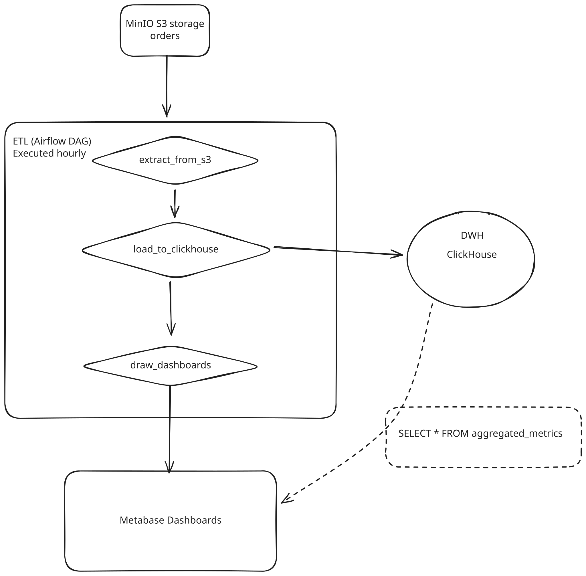

# DWH Scheme: Scooter Rental Service

## Architecture



**S3 → ClickHouse → Metabase Dashboards**


## Technology Stack

### Data Sources
- **S3 Storage**: Долгосрочное хранилище заказов
  - Bucket: `orderse`
  - Format: JSON files

### Data Processing
- **Apache Airflow 2.8.1**: ETL
  - DAG: `scooter_rental_etl`
  - Schedule: Hourly
  - Execution Mode: Standalone (LocalExecutor)

### Data Warehouse
- **ClickHouse**: OLAP база данных
  - Schema: одна таблица для хранения всех заказов, и матвью на неё для агрегации собираемых метрик
  - Data retention: 1 year

### Business Intelligence
- **Metabase v0.48.3**: Дашборды
  - Дашборды: 5 метрик

## ETL Process

### DAG: `scooter_rental_etl`
**Schedule**: Раз в пол часа

**Tasks**:
1. **extract_from_s3**: Вытаскиваем JSON из S3 bucket, будем хранить список обарботанных id в файле на каждый день в S3, чтобы качать только новые файлы

2. **load_to_clickhouse**: Пишем данные из json в ClickHouse

3. **draw_dashboards**: Дергаем Metabase, чтобы он сходил в матвью кликхауса за данными из aggregated_matrics и нарисовала графики

**Dependency Graph**:
```
extract_from_s3 ──> load_to_clickhouse ──> draw_dashboards
```

## Схемы таблиц в ClickHouse
### Схема таблицы `orders`
```sql
CREATE TABLE IF NOT EXISTS orders (
    order_id UInt64 PRIMARY KEY,
    user_id  UInt64 NOT NULL,
    scooter_id  UInt64 NOT NULL,
    total_price UInt32 NOT NULL,
    started_at DateTime NOT NULL,
    finished_at DateTime NOT NULL,
    ttl UInt32 NOT NULL
);
```

### Схема таблицы `aggregated_metrics`
```sql
CREATE MATERIALIZED VIEW IF NOT EXISTS aggregated_metrics
ENGINE = MergeTree()
ORDER BY (metric_date, metric_tenmin)
POPULATE
AS
SELECT
    toDate(time_start) as metric_date,
    toStartOfTenMinutes(time_start) as metric_tenmin,
    sum(total_price) as total_revenue,
    avg(total_price) as avg_order_price,
    count(*) as orders_count,
    count(DISTINCT user_id) as users_count,
    avg(toUnixTimestamp(finished_at) - toUnixTimestamp(started_at)) / 60 as avg_ride_duration_minutes,
    now() as calculated_at
FROM orders
WHERE time_finish IS NOT NULL
GROUP BY metric_date, metric_tenmin;
```

## Business Metrics

| # | Metric Name | Source | Calculation |
|---|-------------|--------|-------------|
| 1 | **Total Revenue** | `total_revenue` | SUM(total_price) |
| 2 | **Orders Count** | `orders_count` | COUNT(DISTINCT order_id) |
| 3 | **Users Count** | `users_count` | COUNT(DISTINCT user_id) |
| 4 | **Avg Ride Duration** | `avg_ride_duration_minutes` | AVG(finished_at - stared_at) in minutes |
| 5 | **Avg Order Price** | `avg_order_price` | AVG(total_price) |

#### Схема таблицы `orders`

## Design Decisions

Почему S3 как источник данных?

* Прямой доступ к данным заказов из сервиса
* Так сложилось при разработке микросервисов
* Экономичное хранение архивных данных
* Из минусов - невозможность запрашивать данные батчами из-за чего высокая нагрузка на сеть

Почему ClickHouse для аналитики?

* Оптимизирован для аналитических запросов
* Быстрая работа с большими объемами данных
* Колоночное хранение для эффективного фильтрации
* Матвью для удобной агрегации метрик и их хранения, дашборды будут рисоваться быстрее

Почему ETL раз в пол часа?

* Достаточно для нужд бизнес-отчетности и мониторинга, можно и чаще при нашем объеме S3
* Снижает нагрузку на инфраструктуру
