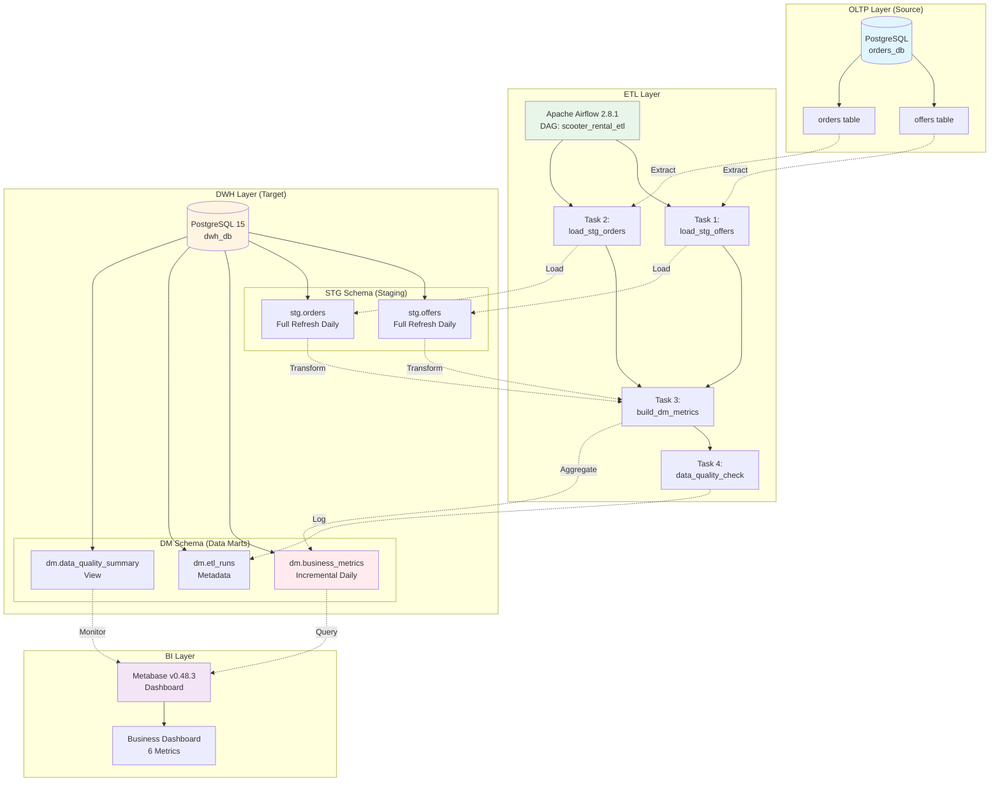
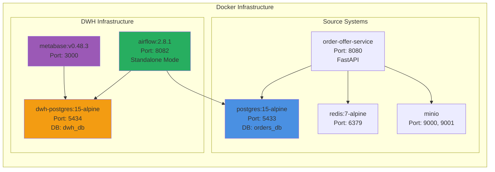
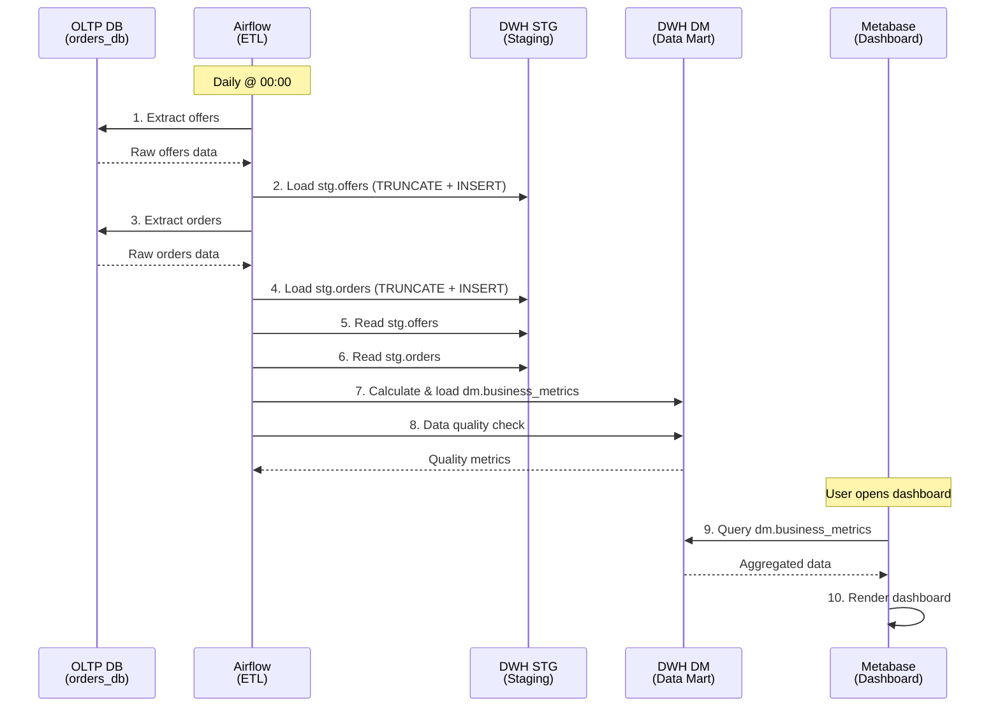

# DWH Architecture Diagram: Scooter Rental Service

## High-Level Architecture



---

## Physical Architecture



---

## Technology Stack

### Source Layer (OLTP)
- **Database**: PostgreSQL 15 Alpine
- **Schema**: `orders_db`
- **Tables**: `offers`, `orders`
- **Access**: Read-only via Airflow connection
- **Port**: 5433 (mapped from 5432 internally)

### ETL Layer
- **Tool**: Apache Airflow 2.8.1
- **Mode**: Standalone (LocalExecutor)
- **Scheduler**: Daily at midnight
- **DAG File**: `src/dwh/dags/etl_main_dag.py`
- **Web UI**: http://localhost:8082
- **Credentials**: admin / admin
- **Connections**:
  - `oltp_postgres`: Source OLTP database
  - `dwh_postgres`: Target DWH database

### DWH Layer
- **Database**: PostgreSQL 15 Alpine
- **Instance**: `dwh-postgres` (separate from OLTP)
- **Port**: 5434 (mapped from 5432 internally)
- **Schemas**:
  - `stg`: Staging layer (raw replicas)
  - `dm`: Data marts layer (aggregated metrics)
- **Init Scripts**: `src/dwh/init/01-dwh-schema.sql`

### BI Layer
- **Tool**: Metabase v0.48.3
- **Web UI**: http://localhost:3000
- **Connection**: Direct to `dwh-postgres`
- **Target Schema**: `dm` (read-only)
- **Dashboard**: 6 business metrics

---

## Logical Data Flow



---

## ETL Strategy

### STG Layer (Staging)
| Aspect | Strategy | Rationale |
|--------|----------|-----------|
| **Refresh Type** | Full Refresh | Simple implementation, small data volume |
| **Method** | TRUNCATE + INSERT | Fast for complete table reload |
| **Frequency** | Daily | Aligns with business reporting needs |
| **Data Retention** | 7 days | Sufficient for troubleshooting |
| **Error Handling** | Retry 2x with 5min delay | Handle transient failures |

### DM Layer (Data Marts)
| Aspect | Strategy | Rationale |
|--------|----------|-----------|
| **Refresh Type** | Incremental | Only recalculate recent period |
| **Method** | DELETE period + INSERT | Update last 7 days of metrics |
| **Frequency** | Daily | After STG layer loads |
| **Data Retention** | 1 year | Business requirement |
| **Aggregation** | Daily grain | Balance between detail and performance |

---

## Data Model

### STG Layer (Dimensional Model - Source Replicas)

```
stg.offers (Fact)
├── offer_id (PK)
├── user_id (FK → users, not in scope)
├── scooter_id (FK → scooters, not in scope)
├── time_offer_creation (TIME)
├── price_per_minute (MEASURE)
├── price_unlock (MEASURE)
├── deposit (MEASURE)
├── ttl (ATTRIBUTE)
└── loaded_at (METADATA)

stg.orders (Fact)
├── order_id (PK)
├── user_id (FK → users, not in scope)
├── scooter_id (FK → scooters, not in scope)
├── time_start (TIME)
├── time_finish (TIME)
├── price_per_minute (MEASURE)
├── price_unlock (MEASURE)
├── deposit (MEASURE)
├── ttl (ATTRIBUTE)
└── loaded_at (METADATA)
```

### DM Layer (Aggregate Model)

```
dm.business_metrics (Aggregate Fact)
├── metric_date (PK, TIME DIMENSION)
├── total_revenue (MEASURE) ← SUM
├── avg_order_price (MEASURE) ← AVG
├── orders_count (MEASURE) ← COUNT
├── offers_count (MEASURE) ← COUNT
├── conversion_rate (MEASURE) ← CALCULATED
├── active_users_count (MEASURE) ← COUNT DISTINCT
├── avg_ride_duration_minutes (MEASURE) ← AVG
├── total_ride_minutes (MEASURE) ← SUM
├── completed_orders_count (MEASURE) ← COUNT
├── calculated_at (METADATA)
└── data_quality_score (METADATA)
```

---

## Dashboard Metrics (6 Required)

| # | Metric Name | Source Column | Calculation | Business Value |
|---|-------------|---------------|-------------|----------------|
| 1 | **Total Revenue** | `total_revenue` | SUM(unlock + per_minute × duration) | Key financial metric |
| 2 | **Orders Count** | `orders_count` | COUNT(DISTINCT order_id) | Operational volume |
| 3 | **Conversion Rate** | `conversion_rate` | (orders / offers) × 100 | Marketing efficiency |
| 4 | **Avg Ride Duration** | `avg_ride_duration_minutes` | AVG(finish - start) in minutes | User engagement |
| 5 | **Avg Order Price** | `avg_order_price` | AVG(revenue) per order | Pricing effectiveness |
| 6 | **Active Users** | `active_users_count` | COUNT(DISTINCT user_id) | User base growth |

---

## Deployment Architecture

```
/Users/yakovmuxin/projects/scooters/
├── docker-compose.yml ← Updated with DWH services
├── src/
│   ├── order_offer_service/ ← Existing OLTP service
│   ├── postgres/
│   │   └── init/
│   │       └── 01-schema.sql ← OLTP schema
│   └── dwh/ ← NEW DWH components
│       ├── init/
│       │   ├── 01-dwh-schema.sql ← DWH tables
│       │   └── 02-documentation.md ← This doc
│       ├── dags/
│       │   └── etl_main_dag.py ← Airflow DAG
│       └── docs/
│           └── architecture_diagram.md ← This file
```

---

## Infrastructure Scaling Strategy

### Current Configuration (MVP)
- Single PostgreSQL instance for DWH
- Airflow standalone mode (single node)
- Full refresh for STG layer

### Future Scaling (if needed)
- **Database**: Add read replicas for analytics queries
- **Airflow**: Migrate to CeleryExecutor with multiple workers
- **ETL**: Implement incremental loads for STG layer
- **DDS Layer**: Add normalized dimension tables if complexity grows
- **Caching**: Add Redis for frequently accessed metrics

---

## Monitoring & Observability

### Airflow Monitoring
- **UI**: http://localhost:8082
- **Metrics**: DAG run success rate, task duration
- **Logs**: Available in Airflow UI per task

### DWH Monitoring
- **Table**: `dm.etl_runs` - ETL execution logs
- **View**: `dm.data_quality_summary` - Data freshness
- **Metrics**: Row counts, load times, error rates

### BI Monitoring
- **Metabase**: Built-in query performance metrics
- **Dashboard**: Refresh time, query execution time

---

## Security Considerations

### Database Access
- **OLTP**: Read-only connection for Airflow
- **DWH**: Full access for Airflow, read-only for Metabase
- **Credentials**: Stored in environment variables

### Network Isolation
- All services in same Docker network
- External access only via exposed ports
- No direct database access from outside Docker

### Data Privacy
- No PII stored in DWH (only IDs and metrics)
- User data anonymized in aggregations
- GDPR compliance: User IDs are integers, no personal info

---

## Disaster Recovery

### Backup Strategy
- **OLTP**: Source of truth, already backed up
- **DWH**: Can be fully rebuilt from OLTP via ETL
- **Metabase**: Dashboard configs backed up separately

### Recovery Procedure
1. Restore OLTP database (if needed)
2. Drop and recreate DWH database
3. Run Airflow DAG manually to reload all data
4. Verify data quality via `dm.data_quality_summary`
5. Restore Metabase dashboards from backup

---

## Testing Strategy

### Unit Tests
- ETL functions (Python in Airflow DAG)
- SQL calculations (`dm.calculate_order_revenue`)

### Integration Tests
- End-to-end DAG execution
- Data flow from OLTP → STG → DM

### Data Quality Tests
- Row count validation
- NULL value checks
- Metric calculation accuracy

---

## Performance Benchmarks

| Operation | Expected Time | Acceptable Threshold |
|-----------|---------------|---------------------|
| Load STG offers | 1-2 min | < 5 min |
| Load STG orders | 2-3 min | < 10 min |
| Build DM metrics | 30 sec | < 2 min |
| Data quality check | 5 sec | < 30 sec |
| **Total ETL Duration** | **4-6 min** | **< 15 min** |
| Dashboard query | < 1 sec | < 5 sec |

---

## Cost Estimation

### Infrastructure Costs (Local Dev)
- **Zero cost**: All running on local Docker

### Production Considerations
- **PostgreSQL**: ~$50-100/month for managed service
- **Airflow**: ~$100-200/month for managed service (e.g., MWAA, Cloud Composer)
- **Metabase**: Free (open source) or ~$85/month (cloud)
- **Total**: ~$150-400/month for production deployment

---

## Design Decisions & Rationale

### Why PostgreSQL for DWH?
✅ Already familiar to team  
✅ Sufficient for current data volumes  
✅ ACID compliance for data integrity  
✅ Rich SQL support for complex analytics  
⚠️ Future: Consider ClickHouse for larger scale

### Why Skip DDS Layer?
✅ Data already normalized in OLTP  
✅ Faster implementation (time constraint)  
✅ Simple metrics don't require complex joins  
⚠️ Future: Add if complex multi-fact analysis needed

### Why Full Refresh for STG?
✅ Simple to implement and maintain  
✅ Small data volume (<1M rows)  
✅ Ensures data consistency  
⚠️ Future: Migrate to CDC or incremental if volume grows

### Why Daily ETL Schedule?
✅ Aligns with business reporting cycle  
✅ Reduces infrastructure load  
✅ Simplifies debugging  
⚠️ Future: Consider hourly for real-time needs

---

## Architecture Evolution Roadmap

### Phase 1: MVP (Current)
- [x] STG + DM layers
- [x] Daily ETL via Airflow
- [x] Basic dashboard in Metabase

### Phase 2: Enhancement (Next 3 months)
- [ ] Add incremental loads for STG
- [ ] Implement data validation framework
- [ ] Add more granular metrics (hourly)
- [ ] Create alerts for ETL failures

### Phase 3: Scale (Next 6 months)
- [ ] Add DDS layer with dimension tables
- [ ] Implement Change Data Capture (CDC)
- [ ] Migrate to ClickHouse for analytics
- [ ] Add machine learning features

---

*Architecture Version: 1.0*  
*Last Updated: December 2025*  
*Architecture Owner: DWH Team*

